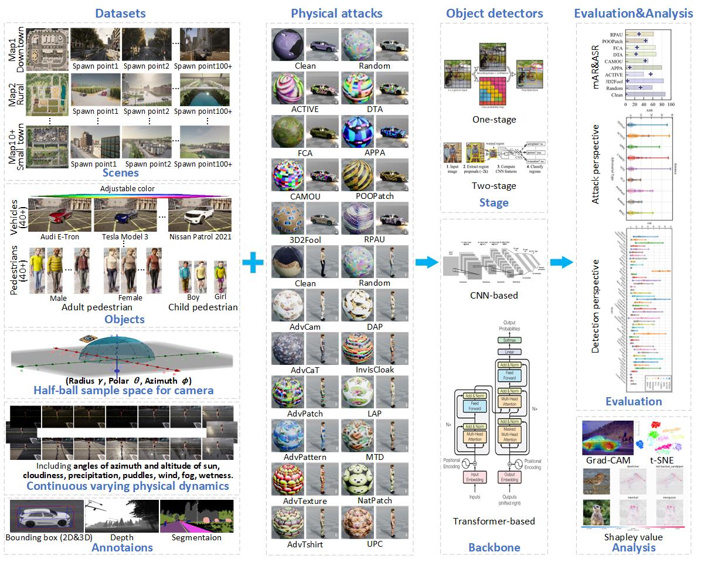
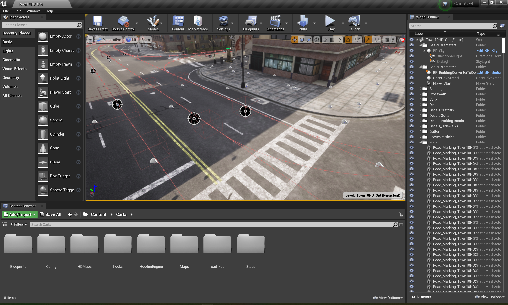

# PADetBench: Benchmark for Physical Attacks Against Object Detection

- [Overview](#overview)
- [Features](#features)
- [Contributions](#contributions)
- [Dataset](#dataset)
- [Installation](#installation)
- [Usage](#usage)
- [Citation](#citation)
- [License](#license)
- [Contact](#contact)

[](https://github.com/JiaweiLian/Benchmarking_Physical_Attack)

## Overview

PADetBench is a comprehensive benchmark designed to evaluate the robustness of object detection models against physical attacks. It addresses the challenges associated with conducting real-world physical experiments, which are often time-consuming, labor-intensive, and difficult to standardize. By leveraging realistic simulation, PADetBench ensures a fair and rigorous evaluation of physical attacks under controlled physical dynamics and cross-domain transformations.



## Features

- **20 Physical Attack Methods**: A wide range of physical attack strategies tailored specifically for object detection tasks.
- **48 Object Detectors**: Includes state-of-the-art detectors, enabling a comprehensive comparison across different architectures.
- **Comprehensive Physical Dynamics**: Simulates diverse environmental conditions such as weather, viewing angles, and distances.
- **Evaluation Metrics**: Provides a set of metrics to assess the effectiveness of attacks and the robustness of detection models.
- **End-to-End Pipelines**: Offers complete workflows for dataset generation, detection, evaluation, and analysis.

## Contributions

- **Fair and Rigorous Evaluation**: Ensures that all evaluations are conducted under the same physical dynamics, eliminating inconsistencies found in real-world experiments.
- **Cross-Domain Transformation Control**: Bridges the gap between physical and digital domains, ensuring that adversarial perturbations survive the transformation process.
- **Detailed Analysis**: Provides deep insights into the performance of physical attacks and the robustness of object detection models through extensive experiments.

## Dataset

The dataset is generated using the CARLA simulator, which provides realistic scenes and physical dynamics. The benchmark includes:

- **Scenes**: Various environments with different map configurations and spawn points.
- **Objects**: A diverse range of vehicles (e.g., Audi E-Tron, Tesla Model 3, Nissan Patrol 2021) and pedestrians with adjustable colors and attributes.
- **Camera Parameters**: Half-ball sample space for camera positioning (radius, polar angle, azimuth angle).
- **Physical Dynamics**: Continuous variations including sun angles, cloudiness, precipitation, puddles, wind, fog, and wetness.

## Installation
This document describes the installation of the required software to run the Carla simulator (0.9.15). The installation can be finished in two steps **within a few minutes**. 
### Installation of Docker
For simplicity, we will use Docker to install Carla. First, we need to install Docker with NVIDIA support:
- Add the GPG key for the official NVIDIA repository to the system:
```bash
distribution=$(. /etc/os-release;echo $ID$VERSION_ID) \
    && curl -fsSL https://nvidia.github.io/libnvidia-container/gpgkey | sudo gpg --dearmor -o /usr/share/keyrings/nvidia-container-toolkit-keyring.gpg \
    && curl -s -L https://nvidia.github.io/libnvidia-container/$distribution/libnvidia-container.list | \
            sed 's#deb https://#deb [signed-by=/usr/share/keyrings/nvidia-container-toolkit-keyring.gpg] https://#g' | \
            sudo tee /etc/apt/sources.list.d/nvidia-container-toolkit.list
```
- Install the NVIDIA container toolkit:
```bash
sudo apt-get update && sudo apt-get install -y nvidia-docker2
```
- Restart the Docker daemon to complete the installation:
```bash
sudo systemctl restart docker
```
- Verify the installation:
```bash
docker run --rm --gpus all nvidia/cuda:11.0-base nvidia-smi
```

### Installation of Carla
- Allow the X server to accept connections from the Docker container:
```bash
xhost +local:root
```
- Pull the Carla Docker image:
```bash
docker pull carlasim/carla:0.9.15
```
- Run the Carla Docker container:
```bash
sudo docker run --privileged -p 2000-2002:2000-2002 --runtime=nvidia --gpus all -e DISPLAY=$DISPLAY -e XAUTHORITY=$XAUTHORITY -e SDL_VIDEODRIVER=x11 -v /tmp/.X11-unix:/tmp/.X11-unix -it carlasim/carla:0.9.15 ./CarlaUE4.sh
```
Then the UI comes up as below.


## Usage

### Setup

1. Clone the repository:
   ```bash
   git clone https://github.com/JiaweiLian/PADetBench.git
   ```
2. Install dependencies:
    ```bash
    pip install -r requirements.txt
    ```
### Running Experiments

Before running experiments, the users can customize their adversarial objects, please refer to [customize_adversarial_objects.md](./documents/customize_adversarial_objects.md)

1. Generate datasets:
    ```bash
    python export_datasets_with_coco_label.py --benchmark entire --actor-type vehicle --adv-type random
    ```
    The users can adjust the args accordingly as they wish.
2. Detection
    ```bash
    python validations.py --detection-path /path/to/detection --gpu 1
    ```
3. Evaluation
    ```bash
    python plots-bar.py --data-path results/vehicle.csv --save-path results/vehicle-bar.pdf
    ```
For Detection and Evaluation, please refer to [file](./auto-detect-validation/README.md) for details.

## Citation

If you use PADetBench in your research, please cite the following publication:

```
@inproceedings{lian2024padetbench,
  title={PADetBench: Towards Benchmarking Physical Attacks against Object Detection},
  author={Lian, Jiawei and Pan, Jianhong and Wang, Lefan and Wang, Yi and Chau, Lap-Pui and Mei, Shaohui},
  booktitle={arXiv},
  year={2024}
}
```

## License

This project is licensed under the MIT License.

## Contact

For any inquiries or collaborations, please contact the authors at:

* Jiawei Lian: jiawei.lian@connect.polyu.hk;lianjiawei@mail.nwpu.edu.cn
* Jianhong Pan: jianhong.pan@connect.polyu.com
* Lefan Wang: wanglefan@mail.nwpu.edu.cn
* Yi Wang: yi-eie.wang@polyu.edu.hk
* Lap-Pui Chau: lap-pui.chau@polyu.edu.hk
* Shaohui Mei: meish@nwpu.edu.cn

## Acknowledgments  

The research work was conducted in the JC STEM Lab of Machine Learning and Computer Vision funded by The Hong Kong Jockey Club Charities Trust.

We would like to thank the contributors and supporters who made this project possible.
