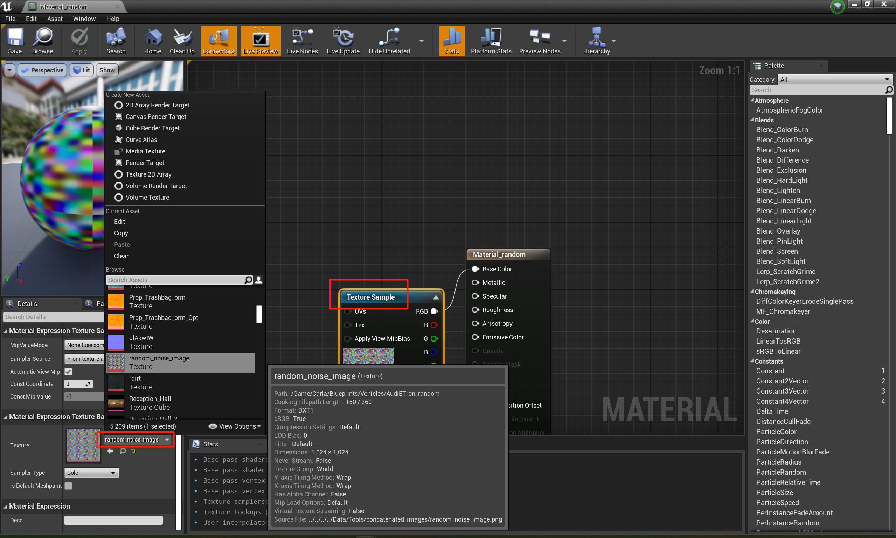

# Customize Adversarial Vehicle

1. **New vehicle blueprint**: Create a new folder for the new vehicle blueprint or directly copy others and adjust accordingly, such as folder name and vehicle blueprint name, in the proper direction, such as ".\Carla\Unreal\CarlaUE4\Content\Carla\Blueprints\Vehicles" for new vehicles. 

2. **Import texture**: Go to the ***Content Browser*** tab and the corresponding folder of the adversarial vehicle created in step 1. Right-click in the browser window and select `Import to ...`. Navigate to where your texture file (perturbation image) is saved and import it. 

3. **Assign adversarial texture to material**: Content Browser --> double click "Material_random" --> click "Texture Sample" --> Select texture in the ***Details*** tab, which is uploaded in step 2. 

4. **Assign adversarial material to the vehicle**: Content Browser --> double click blueprint, such as "BP_Audi_Etron_random" (named by yourself) --> click "Mesh (VehicleMesh) (Inherited)" in the ***Components*** tab --> change ***Materials***.***Element 1*** to the desired adversarial material. Then Compile and save.

5. In `Content/Carla/Blueprint/Vehicle`, open the `VehicleFactory` file.

6. In the ***Generate Definitions*** tab, click **Vehicles**.

7. In the ***Details*** panel, expand the ***Default Value*** section and add a new element to the vehicle array.

8. Fill in the ***Make*** and ***Model*** of your vehicle.
9. Fill in the ***Class*** value with your `BP_<vehicle_name>` file.

10. Optionally, provide a set of recommended colors for the vehicle.
11. Compile and save.

12. Other adversarial actors can be customized similarly.