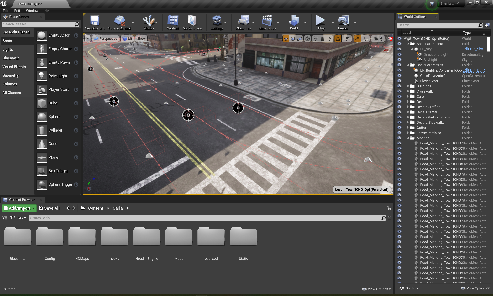

# Launch CarlaUE4
1. Commands should be executed via the "x64 Native Tools Command Prompt for VS 2022". Open this by clicking the "Windows key" and searching for "x64" and then click to open "x64 Native Tools Command Prompt for VS 2022".
2. Change to PowerShell by command `powershell`
3. Open the root CARLA folder, all commands should be run in this folder.
4. Activate the virtue environment for Carla.
5. Run `make launch GENERATOR="Visual Studio 17 2022"`
6. Finally, waiting until the UI comes up as shown in the following figure.

